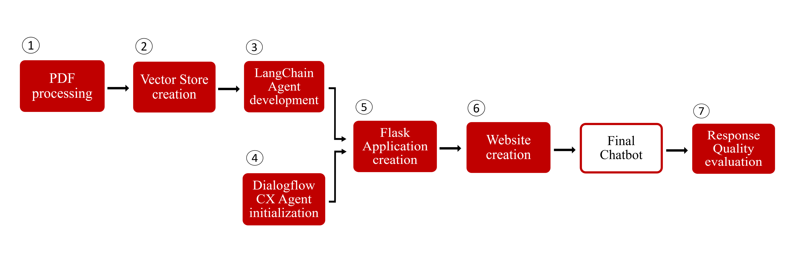

# F-One
> Automatic Text-Generation with Deep Learning Models: a Chatbot based application.


This project aims to develop a Conversational Assistant, in particular an Emotional Chatbot AI Question & Answer Text-Generation Knowledge-based, 
capable of handling conversations with users. The Chatbot is called “F-One” and is able to answer all 
questions related to the sport of Formula 1. Specifically, it is designed to provide information about the 
regulations of F1 and past as well as recent news.

---

## Project description

**Workflow**

  <p align="center">
  
  </p>

As the picture shows, the project may be divided into seven main phases:

 * [**Phase 1**: PDF Processing](#phase-1-pdf-processing)
 * [**Phase 2**: Vector Store Creation](#phase-2-vector-store-creation)
 * [**Phase 3**: LangChain Agent Development](#phase-3-langchain-agent-development)
 * [**Phase 4**: Dialogflow CX Agent Initialization](#phase-4-dialogflow-cx-agent-initialization)
 * [**Phase 5**: Flask Application Creation](#phase-5-flask-application-creation)
 * [**Phase 6**: Website Creation](#phase-6-website-creation)
 * [**Phase 7**: Response Quality Evaluation](#phase-7-response-quality-evaluation)
 
### Phase 1: PDF Processing
In this phase, I processed the PDF documents related to the Formula 1 regulations to extract relevant information. The algorithm implemented to extract the relevant text from 
the PDFs is present in [`process_pdf.py`](https://github.com/filippoflorindi/F-One/blob/main/F-One/process_pdf.py).

### Phase 2: Vector Store Creation
In this phase, I used the information extracted from the PDF documents to create a Vector Store. This store serves as a knowledge base for F-One and enables quick access to the necessary information during conversations. In the creation of the Vector Store for Formula 1 regulation information, I used the *Text_Embedding-Ada-002* model from OpenAI as embedding model and *FAISS (Facebook AI Similarity Search)* Vector Store as system. The script that runs this part is [`vector_store.py`](https://github.com/filippoflorindi/F-One/blob/main/F-One/vector_store.py).

### Phase 3: LangChain Agent Development
This phase involved the development of the LangChain Agent. This process included implementing the Information-Retrieval system and applying the EmoRoBERTa model. The objective was to integrate these components with the *GPT-3.5-Turbo* (ChatGPT) model from OpenAI through the Prompt Engineering process using LangChain. The script that runs this part is [`langchain_agent.py`](https://github.com/filippoflorindi/F-One/blob/main/F-One/langchain_agent.py).

### Phase 4: Dialogflow CX Agent Initialization
In this phase, I initialized the Dialogflow CX Agent. This agent is responsible for managing conversations with users and coordinating the responses provided by F-One.

### Phase 5: Flask Application Creation
This phase involved creating a Flask application that integrates the LangChain Agent with the Dialogflow CX Agent through a Webhook. 

### Phase 6: Website Creation
In this phase, I created the F-One website and subsequently made it public via GitHub Pages. The website provides a user-friendly interface for interacting with F-One and obtaining desired information about Formula 1.

### Phase 7: Response Quality Evaluation
Finally, in the conclusive and seventh step, I conducted an evaluation of the quality of the responses provided by F-One regarding questions about the Formula 1 regulations. This step allowed for assessing the effectiveness of the Chatbot and making any necessary improvements.
  
---


## Dev-Setup
Prerequisites:
- [Google CSE ID](https://programmablesearchengine.google.com/about/) - Free
- [Google API Key](https://cloud.google.com/docs/authentication/api-keys?hl=it) - Free
- [OpenAI API Key](https://platform.openai.com/account/api-keys) - Billing Required
- [Hugging Face Hub API Token](https://huggingface.co/docs/hub/index) - Free
- [Inspiredco API Key](https://docs.inspiredco.ai/critique/getting_started.html) - Free
- [Dialogflow 

## Requirements
Install dependencies:
```pip install -r requirements.txt```


Reference [`example.env`](https://github.com/filippoflorindi/F-One/blob/main/F-One/example.env) to create `.env` file
```python
GOOGLE_CSE_ID = ""
GOOGLE_API_KEY = ""
OPENAI_API_KEY = ""      
HUGGINGFACEHUB_API_TOKEN = "" 
INSPIREDCO_API_KEY = ""
```

## Credits

The F-One Chatbot was developed by [Filippo Florindi](https://github.com/filippoflorindi).
- E-mail: [filippo.florindi@gmail.com][mail]
- LinkedIn: [https://www.linkedin.com/in/filippo-florindi-130483259][linkedin]

## License

Do not Redistribute!

## Info

Link to this project: [https://github.com/filippoflorindi/F-One][project]

[project]: https://github.com/filippoflorindi/F-One
[mail]: filippo.florindi@gmail.com
[linkedin]: https://www.linkedin.com/in/filippo-florindi-130483259
