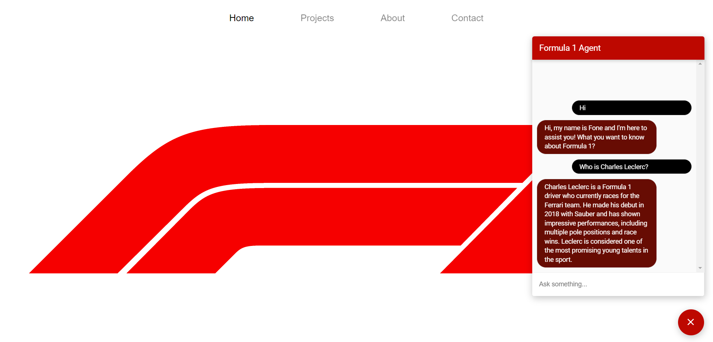

# F-One
> Automatic Text-Generation with Deep Learning Models: a Chatbot based application.


This project aims to develop a Conversational Assistant, in particular an Emotional Chatbot AI Question & Answer Text-Generation Knowledge-based, 
capable of handling conversations with users. The Chatbot is called “F-One” and is able to answer all 
questions related to the sport of Formula 1. Specifically, it is designed to provide information about the 
regulations of F1 and past as well as recent news.

---

## Project description

**Workflow**

  <p align="center">
  
  </p>

As the picture shows, the project may be divided into seven main phases:

 * [**Phase 1**: PDF Processing](#phase-1-pdf-processing)
 * [**Phase 2**: Vector Store Creation](#phase-2-vector-store-creation)
 * [**Phase 3**: LangChain Agent Development](#phase-3-langchain-agent-development)
 * [**Phase 4**: Dialogflow CX Agent Initialization](#phase-4-dialogflow-cx-agent-initialization)
 * [**Phase 5**: Flask Application Creation](#phase-5-flask-application-creation)
 * [**Phase 6**: Website Creation](#phase-6-website-creation)
 * [**Phase 7**: Response Quality Evaluation](#phase-7-response-quality-evaluation)
 
### Phase 1: PDF Processing
In this phase, I processed the PDF documents related to the Formula 1 regulations to extract relevant information. The algorithm implemented to extract the relevant text from 
the PDFs is present in [`process_pdf.py`](https://github.com/filippoflorindi/F-One/blob/main/F-One/process_pdf.py).

### Phase 2: Vector Store Creation
In this phase, I used the information extracted from the PDF documents to create a Vector Store. This store serves as a knowledge base for F-One and enables quick access to the necessary information during conversations. In the creation of the Vector Store for Formula 1 regulation information, I used the *Text_Embedding-Ada-002* model from OpenAI as embedding model and *FAISS (Facebook AI Similarity Search)* Vector Store as system. The script that runs this part is [`vector_store.py`](https://github.com/filippoflorindi/F-One/blob/main/F-One/vector_store.py).

### Phase 3: LangChain Agent Development
This phase involved the development of the LangChain Agent. This process included implementing the Information-Retrieval system for the information related to the F1 regulations and also the creation of a customized search engine, with Google Programmable Search Engine, to allow F-One to manage also all the others information about Formula 1 but different from the FIA regulations. In addition, I implemented in F-One's application the EmoRoBERTa model, which can classify the emotion resulting from the message text sent by the user to the Chatbot (if relevant). EmoRoBERTa is able to classify 27 different emotions in addition to the neutral state. In this way, F-One is able to respond sensitively and emotionally. The last component of the LangChain Agent that I implemented is memory. F-One being a chatbot must be able to maintain a state of conversational memory to remember relevant information that the user provides to it through chat. The type of memory implemented in F-One is ConversationalBufferWindowMemory. The objective to develop the LangChain Agent was to integrate all these components with the *GPT-3.5-Turbo* (ChatGPT) model from OpenAI through the Prompt Engineering process using LangChain. The script that runs this part is [`langchain_agent.py`](https://github.com/filippoflorindi/F-One/blob/main/F-One/langchain_agent.py). While the script implemented for the Emotion Detection is [`emotion_detection.py`](https://github.com/filippoflorindi/F-One/blob/main/F-One/emotion_detection.py).

**LangChain Agent Schema**

  <p align="center">
  
  </p>

### Phase 4: Dialogflow CX Agent Initialization
In this phase, I initialized the Dialogflow CX Agent. Dialogflow allows for the expansion of Chatbot functionalities and the management of various aspects. 
In the specific case of F-One, I modified the Start Page in the Default Start Flow through the Dialogflow CX console. The Start Page includes the Default Welcome Intent.  The Start Page also includes handlers for the sys.no-match-default and sys.no-input-default events. 
First, I set the response that the Chatbot will provide when the Default Welcome Intent is recognized. This way, for all welcome messages sent by a user to F-One, the Chatbot will respond as follows: “Hi, my name is F-One and I’m here to assist you! What do you want to know about Formula 1?”.
Next, to connect the LangChain Agent to the Dialogflow Agent and enable response generation, I created a webhook. I named the webhook as ‘f1-webhook’. 
Next, I enabled a webhook calling in Dialogflow for both the sys.no-match-default and sys.no-input-default events. Since no new intent has been added in the Dialogflow CX Agent, all user expressions other than ‘Hi,’ ‘Hello,’ etc. will trigger the sys.no-match-default event, while all empty user expressions will trigger the sys.no-input-default event. Therefore, these two fallback events can be used to connect the two Agents.
Furthermore, in fulfillment there is a field associated with the webhook, called the tag. In the Dialogflow CX Agent that I created for F-One, the tag that is used is “f1”. These steps alone do not make everything work. It will be necessary to implement a locally executed application to combine the two Agents. The webhook only serves as a bridge for the connection.

### Phase 5: Flask Application Creation
This phase involved creating a Flask application that integrates the LangChain Agent with the Dialogflow CX Agent through a Webhook. The script that runs this part is [`main.py`](https://github.com/filippoflorindi/F-One/blob/main/F-One/main.py). Once implemented, the Flask application is now ready to be run. However, since it is located on the local system, it is not accessible from the outside world. To integrate it as a webhook with Dialogflow CX, it needs to be made live/online. For this purpose, I used Ngrok.

**F-One Flask Application**

  <p align="center">
  
  </p>

### Phase 6: Website Creation
In this phase, I created the F-One website and subsequently made it public via GitHub Pages. The website provides a user-friendly interface for interacting with F-One and obtaining desired information about Formula 1. The folder containing the HTML and CSS scripts for the website is [`web site`](https://github.com/filippoflorindi/F-One/tree/main/web%20site).

**Final Chatbot**

  <p align="center">
  
  </p>

### Phase 7: Response Quality Evaluation
Finally, in the seventh concluding phase, I conducted an evaluation of the quality of the answers provided by F-One regarding questions about Formula 1 regulations. This phase allowed to evaluate the effectiveness of the chatbot and to make possible improvements. In particular, two different aspects of F-One's responses were evaluated. The first is related to the correctness of the answers regarding the questions and the context provided. In this case, I considered the BERT Score and UniEval Factual Consistency metrics. The second aspect, relates to the correctness of the response text generated by F-One at the dialogue level. Specifically, I evaluated the following parameters using UniEval metric: naturalness, coherence, engagingness, groundedness, and understandability.
During the evaluation process, I used a test dataset, 
consisting of tuples, each comprising:
- A question about a piece of information related to Formula 1 regulations.
- A correct target answer/the correct context selected from the Formula 1 regulation PDFs.
- The response generated by F-One in relation to the question.

This way, it was possible to compare the answers provided by the Chatbot, for a given question with the correct ones and calculate the evaluation metrics. The dataset comprises a 
total of 30 tuples, including 10 tuples each related to the Sporting Regulation, Technical Regulation, and Financial Regulation, respectively. In the following are present the tables showing the scores that I obtained for the various parameters for the 30 tuples. The scripts that execute this part are: [`evaluation.py`](https://github.com/filippoflorindi/F-One/blob/main/F-One/evaluation.py) and [`evaluation_unieval.ipynb`](https://github.com/filippoflorindi/F-One/blob/main/F-One/evaluation_unieval.ipynb).

**Evaluation Results**

  <p align="center">
  
  </p>

  
---

## Dev-Setup
Pre-Requisites:
- [Google CSE ID](https://programmablesearchengine.google.com/about/) - Free
- [Google API Key](https://cloud.google.com/docs/authentication/api-keys) - Free
- [OpenAI API Key](https://platform.openai.com/account/api-keys) - Billing Required
- [Hugging Face Hub API Token](https://huggingface.co/docs/hub/index) - Free
- [Inspiredco API Key](https://docs.inspiredco.ai/critique/getting_started.html) - Free
- [Dialogflow CX Agent](https://cloud.google.com/dialogflow/cx/docs) - Billing Required

## Requirements
Install dependencies:
```pip install -r requirements.txt```

## Directory structure

```
.
├── F-One
│   ├── Google Cloud Credentials
│   |   └── dialogflow_CX_agent_secrets.json
│   ├── config.py
│   ├── emotion_detection.py
│   ├── evaluation.py
│   ├── evaluation_unieval.ipynb
│   ├── example.env
│   ├── langchain_agent.py
│   ├── main.py
│   ├── process_pdf.py
│   └── vector_store.py
├── data
│   ├── fia_2023_formula_1_sporting_regulations_-_issue_4_-_2023-02-22.pdf
│   ├── fia_2023_formula_1_technical_regulations_-_issue_5_-_2023-02-22.pdf
│   └── fia_formula_1_financial_regulations_iss.14_.pdf
├── docs
│   ├── images
│   |   ├── F-One_Evaluation_Results.png
│   |   ├── F-One_Flask_Application.png
│   |   ├── F-One_Schema.png
│   |   ├── F-One_Workflow.png
│   |   ├── F-One_Workflow_Horizontal.png
│   |   ├── Website_with_F-One.png
│   |   └── Website_with_F-One_Zoom.png
│   └── F-One Presentation.pdf
├── evaluation dataset
│   └── dataset.txt
├── vector store
│   ├── index.faiss
│   └── index.pkl
├── website
│   ├── images
│   |   └── 2180263.png
│   ├── index.html
│   └── style.css
├── README.md
└── requirements.txt
```


## Credits

The F-One Chatbot was developed by [Filippo Florindi](https://github.com/filippoflorindi).
- E-mail: [filippo.florindi@gmail.com](mailto:filippo.florindi@gmail.com)
- GitHub: [https://github.com/filippoflorindi][github]
- LinkedIn: [https://www.linkedin.com/in/filippo-florindi-130483259][linkedin]

## License

Do not Redistribute!

## Info

Link to this project: [https://github.com/filippoflorindi/F-One][project]

[project]: https://github.com/filippoflorindi/F-One
[github]: https://github.com/filippoflorindi
[linkedin]: https://www.linkedin.com/in/filippo-florindi-130483259
